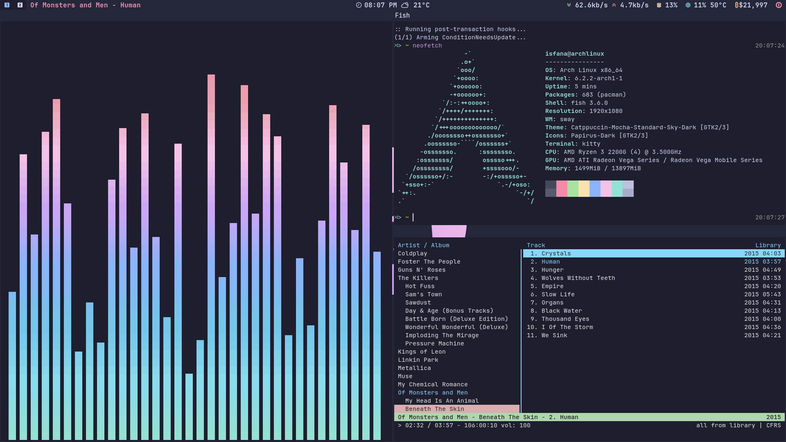

 <h1 align="center">Simple setup Sway Wayland</h1>

                 

</table>

 

 

| task              | name                   |
| ----------------- | ---------------------- |
| wm                | [sway](https://swaywm.org/)                                      |
| terminal          | [alacritty](https://github.com/alacritty/alacritty)                                      |
| music player      | [cmus](https://cmus.github.io/)         |
| shell             | [fish](https://fishshell.com/)                            |
| launcher          | [wofi](https://hg.sr.ht/~scoopta/wofi)
| bar               | [waybar](https://github.com/Alexays/Waybar)                   |
| file manager              | [thunar](https://docs.xfce.org/xfce/thunar/start)                   |
| login manager              | [emptty](https://github.com/tvrzna/emptty)                 |
| logout manager              | [wlogout](https://github.com/ArtsyMacaw/wlogout)                   |
| tiling manager       | [swaymonad](https://github.com/nicolasavru/swaymonad)                                 | 
| screenshot        | [grimshot](https://manpages.debian.org/unstable/grimshot/grimshot.1.en.html)                                  | 
| font              | [JetBrainsMono Nerd Font](https://www.nerdfonts.com/font-downloads), [Awesome Font](https://fontawesome.com/)                                       |

 

    
<samp><b>more info</b></samp>

 

* **Added Shortcut**
    * cmus
        - *Ctrl+Alt+m* - open cmus
        - *Ctrl+Alt+space* - play/pause
        - *Ctrl+Alt+n* - next
        - *Ctrl+Alt+b* - previous
        - *Ctrl+Alt+u* - update library
    * cava
        - *Ctrl+Alt+v* - open cava
    * grimshot
        - *Ctrl+Alt+p* - take screenshot
    * wlogout
        - *Ctrl+Alt+q* - open wlogout

* **Added Fish command**
    * addpath
        easily add component to your $PATH
    * removepath
        easily remove component from your $PATH
 
